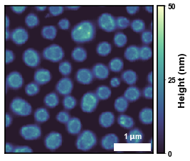
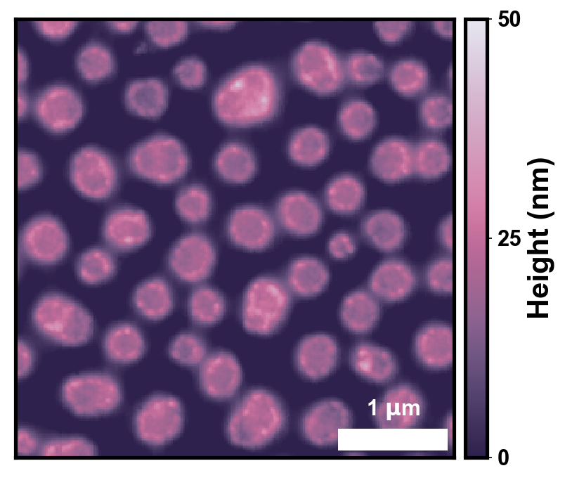
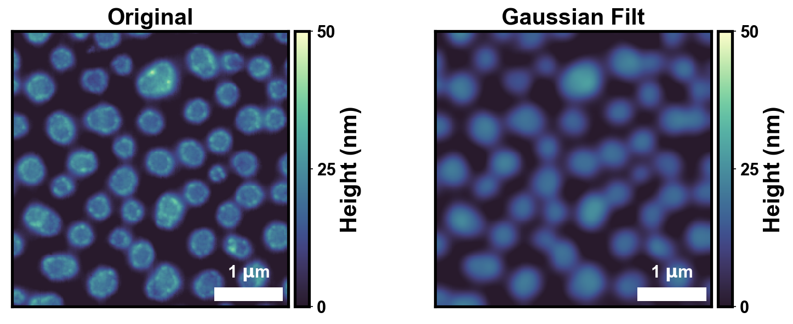

# seaborn-image: image data visualization

<div class="row">

<a>

</a>

<a>

</a>

<a>

</a>

</div>

[](https://github.com/SarthakJariwala/seaborn-image/actions?workflow=Tests)
[](https://codecov.io/gh/SarthakJariwala/seaborn-image)
[](https://pypi.org/project/seaborn-image/)

Seaborn like image data visualization using matplotlib, scikit-image and scipy.

## Description

Seaborn-image is a seaborn like python **image** visualization and processing library
based on matplotlib.

The aim of seaborn-image is to provide a high-level API to **process and plot attractive images quickly and effectively**.


## Installation

``pip install seaborn-image``

## Usage
### Simple usage

```python

    import seaborn_image as isns

    """Plot image"""
    isns.imgplot(data)

    """Plot image with scalebar"""
    isns.imgplot(data, dx=1, units="um")
```

### Set context like seaborn

```python

    import seaborn_image as isns

    isns.set_context("notebook") # Other options include paper, talk, presentation, poster
```

### Apply image filters (from scipy and skimage) and plot

```python

    import seaborn_image as isns

    isns.filterplot(data, filter="gaussian")
```
