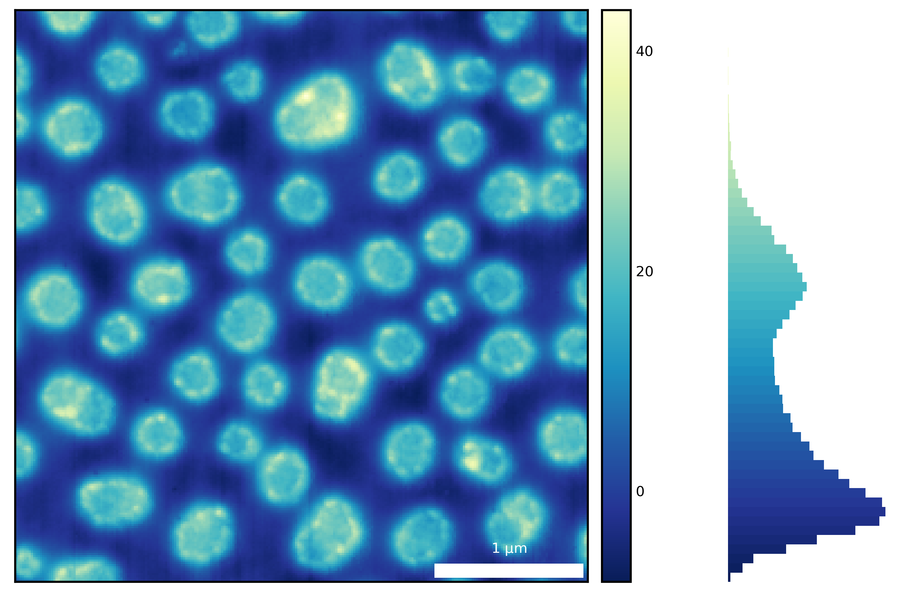
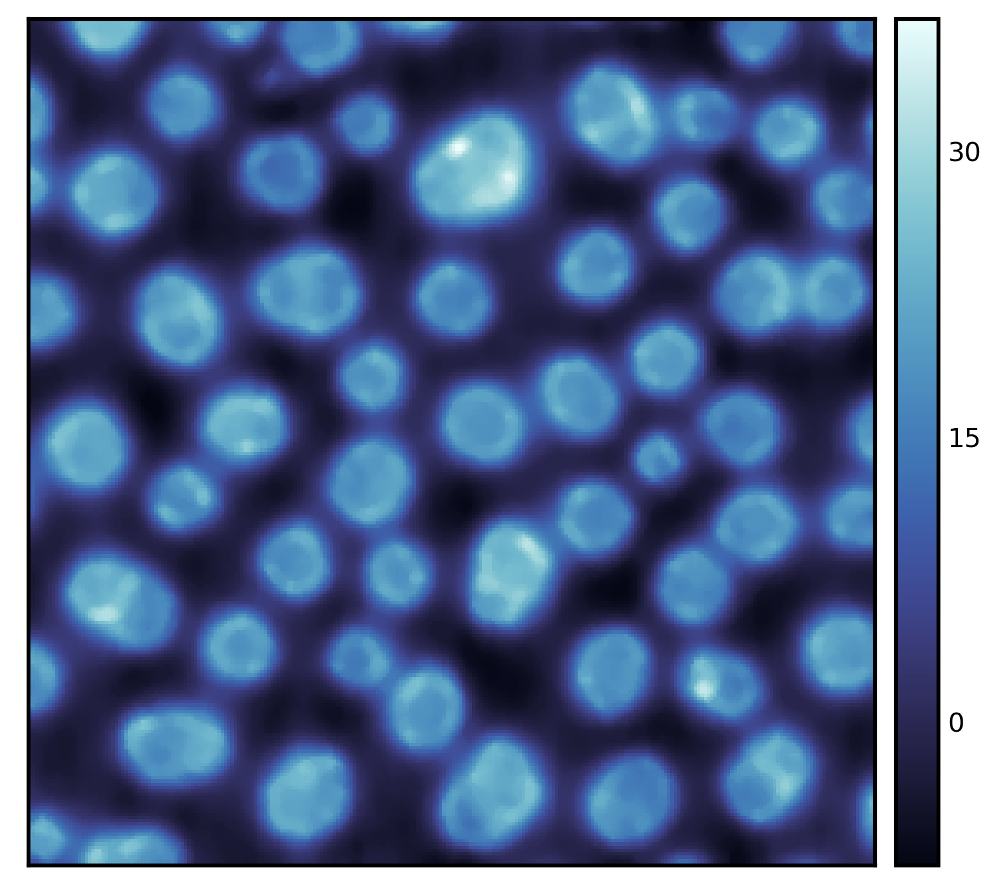
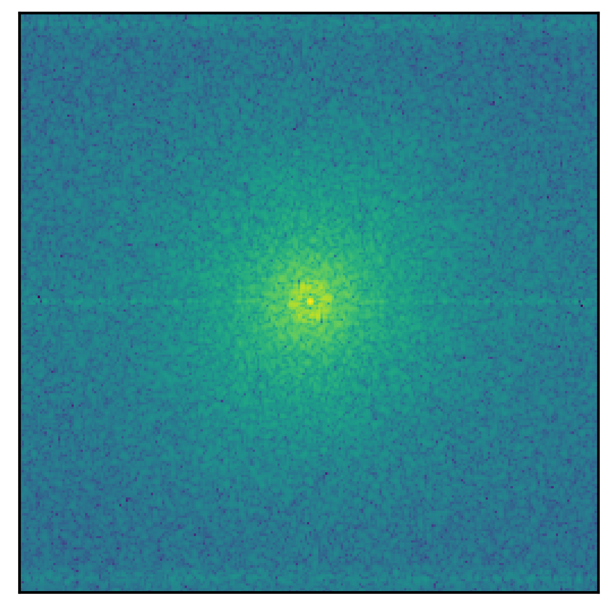
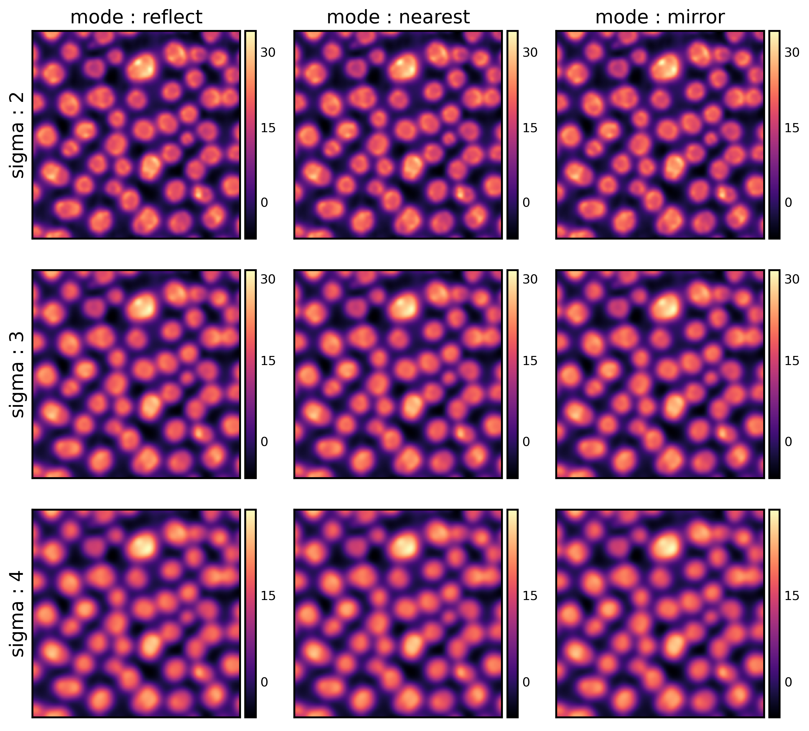
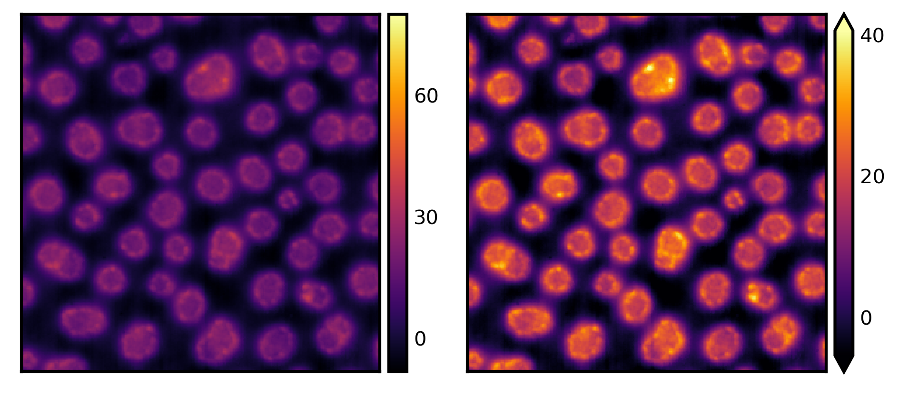

# seaborn-image: image data visualization

[](https://github.com/SarthakJariwala/seaborn-image/actions?workflow=Tests)
[](https://codecov.io/gh/SarthakJariwala/seaborn-image)
[](https://pypi.org/project/seaborn-image/)
[](https://seaborn-image.readthedocs.io/en/latest/?badge=latest)
[](https://github.com/psf/black)


<div class="row">

  <a href="https://seaborn-image.readthedocs.io/en/latest/auto_examples/plot_image_hist.html">
  
  </a>

  <a href="https://seaborn-image.readthedocs.io/en/latest/auto_examples/plot_filter.html">
  
  </a>

  <a href="https://seaborn-image.readthedocs.io/en/latest/auto_examples/plot_fft.html">
  
  </a>

  <a href="https://seaborn-image.readthedocs.io/en/latest/auto_examples/plot_filtergrid.html">
  
  </a>

  <a href="https://seaborn-image.readthedocs.io/en/latest/auto_examples/plot_image_robust.html">
  
  </a>

</div>


## Description

Seaborn-image is a Python **image** visualization library based on matplotlib
and provides a high-level API to **draw attractive and informative images quickly and effectively**.

It is heavily inspired by [seaborn](https://seaborn.pydata.org/), a high-level visualization library
for drawing attractive statistical graphics in Python.

## Documentation

Detailed documentation can be found [here](https://seaborn-image.readthedocs.io/).

- [Tutorial](https://seaborn-image.readthedocs.io/en/latest/tutorial.html)
- [Examples](https://seaborn-image.sarthakjariwala.com/en/latest/auto_examples/index.html)
- [API Reference](https://seaborn-image.readthedocs.io/en/latest/reference.html)

## Installation

For latest release:

Using `pip`

```bash
pip install -U seaborn-image
```

Using `conda`

```bash
conda install seaborn-image -c conda-forge
```

For latest commit
```bash
pip install git+https://github.com/SarthakJariwala/seaborn-image
```

## Contributing

Please see the [contributing guidelines](https://github.com/SarthakJariwala/seaborn-image/blob/master/CONTRIBUTING.rst)
