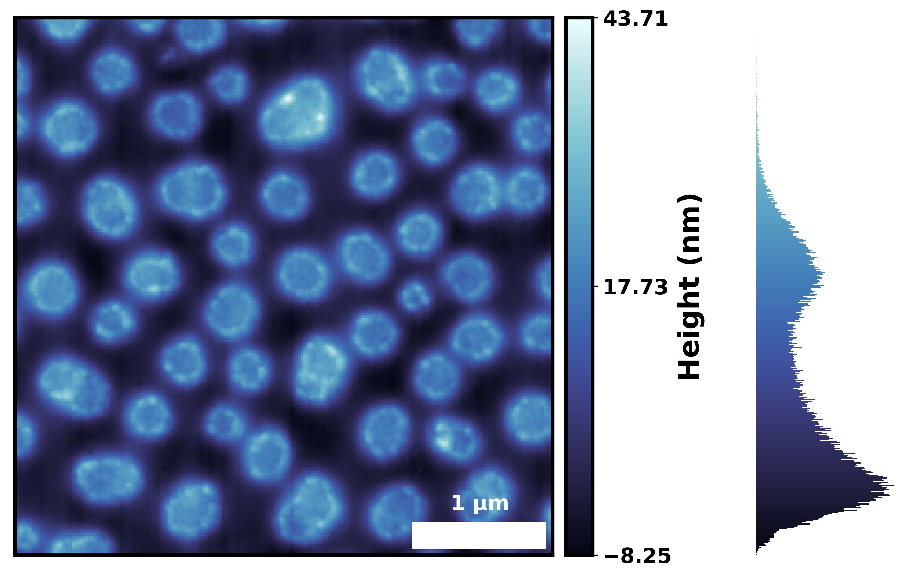
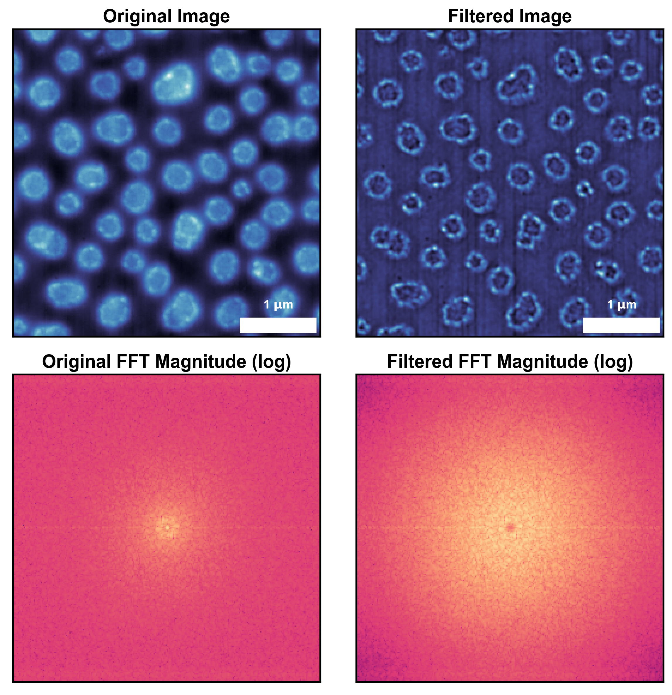

==========
Quickstart
==========

.. contents::
    :local:

Installation
------------

You can install ``seaborn-image`` using ``pip``.

.. code-block:: bash

    pip install seaborn-image

Basic Usage
-----------

Basic image data visualization using ``imgplot``
************************************************

.. code-block:: python

    import seaborn_image as isns
    import numpy as np # for loading data

    # Load data
    data = np.loadtxt("PolymerImage.txt")

    # Plot
    isns.imgplot(data)

Add a scalebar to the image
***************************

.. code-block:: python

    # specify the size-per-pixel (dx) and the units for the scalebar

    isns.imgplot(data, dx=15, units="nm")

In the ``imgplot`` function, you can add a scalebar by specifying
the size-per-pixel (``dx``) and the units (``units``).

Here, we are specifying ``dx = 0.015`` and ``units = 'um'``.
This means that the physical size per pixel is "0.015 um".
You can also specify the same by specifying ``dx = 15`` and ``units= 'nm'``.
This will also give you the same scalebar.

Add a label to the colorbar
***************************

.. code-block:: python

    # specify the colorbar label using cbar_label

    isns.imgplot(data, dx=15, units="nm", cbar_label="Height (nm)")

.. image:: ../examples/image_0.png
    :width: 400px
    :height: 360px

Visualize the distribution of the data using ``imghist``
********************************************************

You can also visualize the image data distribution alongside the image
and its colorbar using ``imghist`` function

.. code-block:: python

    # Plot distribution alongside the image

    isns.imghist(data, dx=15, units="nm", cbar_label="Height (nm)", cmap="ice")

You can also change the number of bins in the distribution using ``bins`` parameter
in ``imghist``. In the above example, we also changed the colormap to 'ice'
using ``cmap = 'ice'``. This is one of the inbuilt colormaps in ``seaborn_image``.
You can also use a ``matplotlib`` colormap - ``cmap = "viridis"``.

Apply image filters from scipy and skimage using ``filterplot``
***************************************************************

You can also process images using scipy and scikit-image filters
and visualize them with minimal effort. This can be done using ``filterplot``
in ``seaborn_image``.

This is as simple as :

.. code-block:: python

    isns.filterplot(data, filter="sobel") # default is gaussian

All the previous customizations such as scalebar, colorbar, etc.
can be applied in the same way as before. Additionally, you can also view the
fast-fourier transform of the original and filtered image simply by setting
``fft = True`` :

.. code-block:: python

    isns.filterplot(data, filter="diff_of_gaussians", fft=True, dx=15, units="nm")

